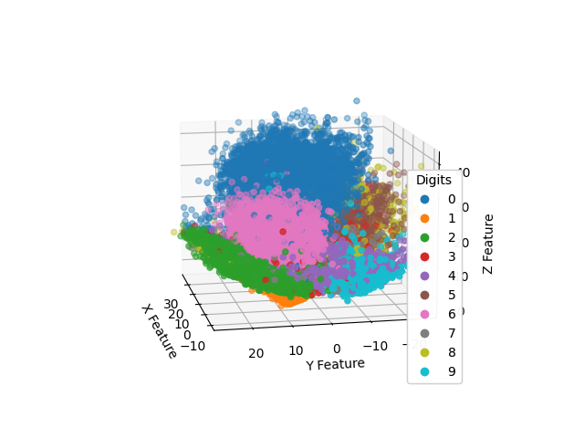

# Auto-encoder-Pytorch

逐行解释的pytorch自编码器实现，保证代码尽可能简单

自编码器（Autoencoder, AE）是一种无监督的学习方法，目标是学习一个压缩的，分布式的数据表示（编码），然后再重构出原始数据。自编码器常用于降维或特征学习，也可以用于去噪和生成模型的一部分。

自编码器由两部分组成：

1. 编码器（Encoder）：
这部分网络负责将输入数据转换成一个更小的，稠密的表示形式（称为编码）。编码是原始数据的压缩表示，旨在捕捉数据的内在特征。
2. 解码器（Decoder）：
解码器部分接受编码作为输入，并尝试重构原始数据。通过比较重构的数据和原始数据，自编码器可以学习如何有效地表示数据。

本项目采用Pytorch框架，并以MNIST数据集为例，实现了自编码器的训练过程。

合成图片样例：

  

## 安装

项目依赖于Pytorch框架。可以通过[Pytorch官网](https://pytorch.org/get-started/locally/)安装。

## 训练

运行 [`train.py`](./train.py)
第一次运行时，数据集会自动下载到当前目录下的 `./data` 文件夹。模型训练完成后，最优模型将保存为 `best.pth` 文件。

## 推理

运行 [`infer.py`](./infer.py)。会从MNIST数据集中随机抽一张图片进行编码和解码，合成图片会保存到 `./reconstructed_image.png` ，并通过matplotlib展示结果。

## 特征可视化

运行 [`plot.py`](./plot.py)。模型会提取所有MNIST训练集图像的编码器特征（可能会需要一些时间），并利用matplotlib对这些特征进行可视化展示：

  

